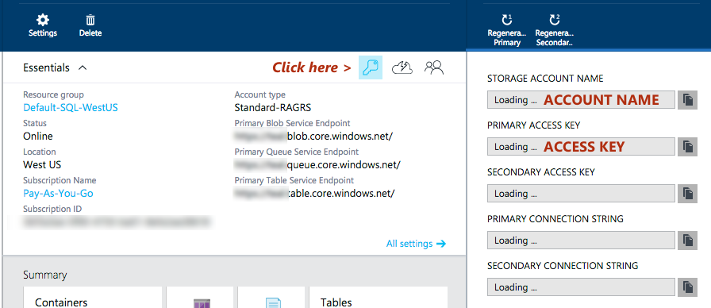

Teal (Azure Storage sample for Xamarin)
=======================================

This sample shows basic usage of the following Azure features in a Xamarin.Forms app for iOS and Android:

* Azure Blob Storage
* Azure Table Storage
* Azure Queue

using the [WindowsAzure.Storage](https://www.nuget.org/packages/WindowsAzure.Storage/4.4.0-preview) NuGet which includes PCL support.

These Azure features all use **Shared Access Signatures (Sas)** for authentication.

On Windows computers you can use PowerShell to help you generate **Sas** for testing these features... in this example I've provided a command line app `GenerateSharedAccessSignatures` which can be run on OS X within Xamarin Studio to generate **Sas** which can then be embedded in the Xamarin.Forms app for testing.

Steps
-----

1. Once you've created an Azure account, go to the **Storage** section 

2. Click on the *key* to view the STORAGE ACCOUNT NAME and PRIMARY ACCESS KEY

   

3. Enter these details in the `GenerateSharedAccessSignatures` source code, and selectively run it for the **Shared Access Signature (Sas)** you want (Blob, Table, Queue)... copy the **Sas** from the console output.

	```
    // TODO: get this info from the azure portal
    static string StorageConnectionString = "DefaultEndpointsProtocol=https;AccountName=FROM_PORTAL;AccountKey=FROM_PORTAL";
	```
	
4. Paste the **Sas** into the Xamarin.Forms app source, in the relevant C# file (Blob.xaml.cs, Table.xaml.cs, Queue.xaml.cs) and run the app in iOS or Android.

	```
	string sas ="?sv=2014-02-14&tn...02Z&sp=raud";
	StorageUri tableStorageUri = new StorageUri(new Uri("https://FROM_PORTAL.table.core.windows.net/")); // from Azure portal
	```
This will enable you to test the functionality of these Azure Storage features quickly and easily on OS X (or Windows), without PowerShell or setting up a website.


Production
----------

This sample is **NOT** set-up for production use.

A production application will need a way to generate **Shared Access Signatures** in real-time, possibly using a website or other back-end facility.

This is beyond the scope of this example, which is just designed to help you test the features on a local device or emulator.


Related Articles
----------------

[WindowsAzure.Storage NuGet](https://www.nuget.org/packages/WindowsAzure.Storage/4.4.0-preview) and [source](https://github.com/Azure/azure-storage-net/tree/preview)

[Generating a Shared Access Signature](http://azure.microsoft.com/en-us/documentation/articles/storage-dotnet-shared-access-signature-part-2/)

[How to create a storage connection string](http://msdn.microsoft.com/en-us/library/azure/ee758697.aspx)

[Getting started with Azure Storage on Xamarin](http://blogs.msdn.com/b/windowsazurestorage/archive/2015/04/29/getting-started-with-azure-storage-on-xamarin.aspx) - Android only, on Windows.

[How to use Azure Storage Tables](http://azure.microsoft.com/en-us/documentation/articles/storage-dotnet-how-to-use-tables/)