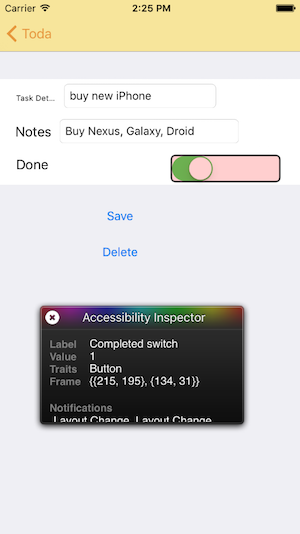

Tasky (accessibility)
============================

This sample demonstrates iOS accessibility features using Xamarin, in particular
VoiceOver which uses the `IsAccessibilityElement` and `AccessibilityLabel` properties to determine what is spoken. You can also set `AccessibilityTraits` and call `UIAccessibility.PostNotification` to communicate with the user.

It is based on the [TaskyL10nStoryboard](https://github.com/conceptdev/xamarin-samples/tree/master/TaskyL10nStoryboard) sample.

The **Accessibility Inspector** is enabled in **Settings > General > Accessibility**

It appears floating over the app while testing. Click the (x) icon to disable and re-able it:

 

## References

[Understanding Accessibility on iOS](https://developer.apple.com/library/ios/documentation/UserExperience/Conceptual/iPhoneAccessibility/Accessibility_on_iPhone/Accessibility_on_iPhone.html#//apple_ref/doc/uid/TP40008785-CH100-SW1)

[Making Your iOS App Accessible](https://developer.apple.com/library/ios/documentation/UserExperience/Conceptual/iPhoneAccessibility/Making_Application_Accessible/Making_Application_Accessible.html#//apple_ref/doc/uid/TP40008785-CH102-SW7)

[Test Accessibility on Your Device with VoiceOver](https://developer.apple.com/library/ios/technotes/TestingAccessibilityOfiOSApps/TestAccessibilityonYourDevicewithVoiceOver/TestAccessibilityonYourDevicewithVoiceOver.html#//apple_ref/doc/uid/TP40012619-CH3-SW1)

[Blog: VoiceOver Accessibility Tips](http://useyourloaf.com/blog/voiceover-accessibility/)

## WARNING: Using Size Classes (Universal Storyboards)

This sample does *not* use Size Classes, but rather is specifically
targeting iPhone in the storyboard.

If you attempt to localize a Storyboard that uses Size Classes you may
run into [this issue (on StackOverflow)](http://stackoverflow.com/questions/24989208/xcode-6-does-not-localize-interface-builder).
The storyboard elements fail to be localized, and always show the base language.

The easy/hack fix is to duplicate your storyboard strings file into
`MainStoryboard~iphone.strings` and `MainStoryboard~ipad.strings`

(apparently under-the-covers the universal storyboard is duplicated into `~ipad`
and `~iphone` versions; which causes the `.strings` file load to fail because
the filenames don't match exactly)
