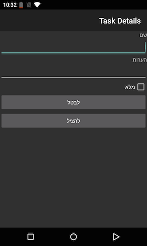

Tasky (localized)
============================

Tasky todo-list application written in Xamarin.iOS and Xamarin.Android, then [localized](http://developer.xamarin.com/guides/cross-platform/advanced/localization/) using the native localization mechanisms.

iOS
---

[iOS Localization with Xamarin](http://developer.xamarin.com/guides/ios/advanced_topics/localization_and_internationalization/) doc

Android
-------

[Android Localization with Xamarin](http://developer.xamarin.com/guides/android/advanced_topics/localization/) doc

See also RTL notes in:

[Native RTL support in Android 4.2](http://android-developers.blogspot.dk/2013/03/native-rtl-support-in-android-42.html)

 